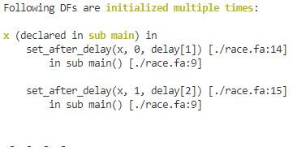

Файл JSON представляет собой массив объектов одинакового типа. У всех ошибок один и тот же общий формат JSON Пример:

```json
[
    {
        "error_code": "...", // тут код ошибки согласно базе, SEM/SYNX(.X)
        "details": {
            ... // произвольный объект, свой для каждой ошибки и состоящий либо из примитивных данных, либо из описанных ниже типичных объектов
        }
    },
    {
        "error_code": "...", // тут код ошибки согласно базе, SEM/SYNX(.X)
        "details": {
            ... // произвольный объект, свой для каждой ошибки и состоящий либо из примитивных данных, либо из описанных ниже типичных объектов
        }
    },
    ....
]
```

По коду ошибки можно получить:

`error_code`: `string`

- ее описание;
- шаблон строки с ее описанием, в который можно подставить дополнительную информацию.

Пример: ошибка = неиспользуемый ФД, шаблон = “DF {0} is never used”, в дополнительной информации будет его имя. Пример из luna_trace:



Тут шаблон мог бы выглядеть как “{0} (declared in {1}) is initialised multiple times:”, и потом 
уровень серьезности (ошибка, предупреждение, слабое предупреждение и т. п.).

## Формат описания типовых объектов

### *Элемент стека вызовов (_call_stack_entry_)*

 * `file`: `string` -- имя файла,
 * `line`: `int` -- номер строки,
 * `name`: `string` -- имя элемента (для операторов -- "for", "while" и т.д.; для вызовов процедур -- имя процедуры).

_Пример:_
```json
{
    "file": "main.fa",
    "line": 42,
    "name": "set_int"
}
```

### *Стек вызовов (_call_stack_)*

Список типовых объектов `_call_stack_entry_`.

_Пример:_
```json
{
    [
        {
            "file": "main.fa",
            "line": 42,
            "name": "set_int"
        },
        {
            "file": "main.fa",
            "line": 53,
            "name": "for"
        }
    ]
}
```

### *ФК (_sub_)*

Описывает атомарный или структурированный ФК.

 * `name`: `string` -- имя,
 * `type`: `"struct"` | `"extern"` -- тип,
 * `file`: `string` -- имя файла,
 * `line`: `int` -- строка объявления (строка импортирования).

_Пример:_
```json
{
    "name": "set_int",
    "type": "extern",
    "file": "main.fa",
    "line": 3
}
```

### *Идентификатор* (_identifier_)

Описывает идентификатор, т.е. либо базовое имя ФД, объявленное после ключевого слова df, либо итератор for/while, либо переменную let, либо аргумент структурированного ФК.

 * `name`: `string` -- имя при объявлении,
 * `declared`:  `_call_stack_` -- место объявления.

_Пример:_
```json
{
    "name": "i",
    "declared": [
        {
            "file": "main.fa",
            "line": 42,
            "name": "set_int"
        },
        {
            "file": "main.fa",
            "line": 53,
            "name": "for"
        }
    ]
}
```

### Ссылка на ФД *(_df_ref_)*

Описывает ссылку на атомарный или индексированный ФД. Содержит информацию о базовом имени, а также локальное выражение-ссылку (например, с участием имени let или аргумента структурированного ФК) и реальное выражение-ссылку (т.е. с участием базового имени).

 * `base_name`: `_identifier_` -- информация об объявлении базового имени,
 * `local`: `_expression_` -- локальное выражение, т.е. локальное имя с (возможно) индексами,
 * `true`: `_expression_` -- глобальное/истинное выражение, т.е. базовое имя со всеми индексами (если они есть),
 * `where`: `_call_stack_` -- место использования.

 _Пример:_
```json
{
    "base_name": {
        "name": "a",
        "declared": [
            {
                "file": "main.fa",
                "line": 40,
                "name": "main"
            }
        ]
    },
    "local": "f[1]",
    "true": "a[2][1]",
    "where": [
        {
            "file": "main.fa",
            "line": 42,
            "name": "main"
        },
        {
            "file": "main.fa",
            "line": 13,
            "name": "foo"
        }
    ]
}
```

### *Индексированный ФД/Диапазон индексов (_index_range_)*

ТУДУ описание

 * `df_ref`: `_df_ref_` -- информация об индексируемом ФД [1],
 * `loop`: `_for_` -- цикл, задающий диапазон индексов,
 * `step`: `_expression_` -- шаг индекса;
 * `offset`:  `_expression_` -- смещение индекса.

Рассматриваются выражения вида `step * loop.var + offset`.

_Пример:_
```json
{
    "todo": "todo"
}
```

### Цикл *for* (_for_)

Описывает оператор цикла for.

 * `var`: `string` -- имя переменной-счетчика,
 * `first`: `_expression_` -- нижняя граница,
 * `last`: `_expression_` -- верхняя граница,
 * `where`: `_call_stack_` -- место цикла в коде.

_Пример:_
```json
{
  "var": "i",
  "first": "1",
  "last": "N + 1",
  "where": [
        {
            "file": "main.fa",
            "line": 42,
            "name": "main"
        },
        {
            "file": "main.fa",
            "line": 13,
            "name": "for"
        }//todo мб этот элемент не нужен?
    ]
}
```

### Условия TODO (_conditions_)

Список условий, т.е. логических выражений `_expression_`.

_Пример:_
```json
{
    [
        "a > 1",
        "b <= c"
    ]
}
```

### Арифметическое выражение (_expression_)

Является атомарным полем, а не структурой. Представляет собой строку, которая содержит арифметическое выражение.

_Пример:_
```json
{
  "expression": "1 + x * y"
}
```

## Форматы описания ошибок

**SYN1 -- Несоответствие типов аргументов LuNA типам формальных параметров при вызове ФК (типы аргументов известны на этапе компиляции)**

```json
{
    "error_code": "SYN1",
    "details": {
      "call_stack": <call_stack>,
      "cf": <cf>
    }
}
```

**SYN2 -- Использование необъявленного ФК**

```json
{
    "error_code": "SYN2",
    "details" : {
      "call_stack_entry": <call_stack_entry>
    }
}
```

**SYN3 -- Несовпадение количества аргументов при объявлении ФК и его вызове** 

```json
{
    "error_code": "SYN3",
    "details": {
        "cf": <cf>,
        "call_stack_entry": <call_stack_entry>
    }
}
```

**SYN4 -- Более одного описания фрагментов данных внутри блока** 

```json
{
    "error_code": "SYN4",
    "details" : {
        "call_stack_entry": <call_stack_entry>
    }
}
```

**SYN5.1 -- Макрос объявлен, но не используется** 

```json
{
    "error_code": "SYN5.1",
    "details": {
        "todo": <todo>
    }
}
```

**SYN5.2 -- Имя, определенное в операторе let, не используется**

```json
{
    "error_code": "SYN5.2",
    "details": {
        "identifier": <identifier>
    }
}
```

**SYN5.3 -- Базовое имя ФД, определенное в операторе df, не используется**

```json
{
    "error_code": "SYN5.3",
    "details": {
        "identifier": <identifier>
    }
}
```

**SYN5.4 -- Атомарный ФК не используется** 

```json
{
    "error_code": "SYN5.4",
    "details": {
        "identifier": <identifier>
    }
}
```

**SYN5.5 -- Структурированный ФК не используется** 

```json
{
    "error_code": "SYN5.5",
    "details": {
        "identifier": <identifier>
    }
}
```

**SYN5.6 -- Параметр структурированного ФК не используется** 

```json
{
    "error_code": "SYN5.6",
    "details": {
        "identifier": <identifier>
    }
}
```

**SYN5.7 -- Счетчик оператора for не используется** 

```json
{
    "error_code": "SYN5.7",
    "details": {
        "identifier": <identifier>
    }
}
```

**SYN5.8 -- Счетчик оператора while не используется** 

```json
{
    "error_code": "SYN5.8",
    "details": {
        "identifier": <identifier>
    }
}
```

**SYN6.1 -- Импортирование ФК под именем уже существующего ФК** 

```json
{
    "error_code": "SYN6.1",
    "details": {
        "cfs": [ <cf>, <cf> ]
    }
}
```

**SYN6.2 -- Объявление структурированного ФК с именем уже существующего ФК** 

```json
{
    "error_code": "SYN6.2",
    "details": {
        "cfs": [ <cf>, <cf> ]
    }
}
```

**SYN7 -- Нет main** 

```json
{
    "error_code": "SYN7",
    "details": {}
}
```

**SYN8.1 -- Повторное объявление базового имени** 

```json
{
    "error_code": "SYN8.1",
    "details": {
        "identifier": <identifier>
    }
}
```

**SYN8.2 -- Повторное объявление имени в операторе for** 

```json
{
    "error_code": "SYN8.2",
    "details": {
        "identifier": <identifier>
    }
}
```

**SYN8.3 -- Повторное объявление имени в операторе while** 

```json
{
    "error_code": "SYN8.3",
    "details": {
        "identifier": <identifier>
    }
}
```

**SYN8.4 -- Повторное объявление переменной let** 

```json
{
    "error_code": "SYN8.4",
    "details": {
        "identifier": <identifier>
    }
}
```

**SYN8.5 -- Повторное объявление аргумента структурированного ФК** 

```json
{
    "error_code": "SYN8.5",
    "details": {
        "identifier": <identifier>
    }
}
```

**SYN9 -- Попытка использования необъявленного идентификатора**

```json
{
    "error_code": "SYN9",
    "details": {
        "identifier": <identifier>
    }
}
```

**SYN10 -- Импортирование несуществующей C/C++ функции** 

```json
{
    "error_code": "SYN10",
    "details": {
        "cf": <cf>
    }
}
```

**SYN11 -- Попытка индексации выражения, не являющегося именем**

```json
{
    "error_code": "SYN11",
    "details": {
        "expression": <expression>,
        "call_stack": [ <call_stack_entry> ]
    }
}
```

**SYN12 -- Сигнатура импортируемого атомарного ФК на LuNA отличается от сигнатуры на C++** 

```json
{
    "error_code": "SYN12",
    "details": {
        "cf": <cf>
    }
}
```

***

**SEM1 -- Использование ФД неправильного типа в качестве аргумента при вызове ФК** 

```json
{
    "error_code": "SEM1",
    "details": {
        "df": <df>,
        "cf": <cf>
    }
}
```

**SEM2.1 -- Повторная инициализация одиночного ФД TODO** 

```json
{
    "error_code": "SEM2.1",
    "details": {
        
    }
}
```

**SEM2.2 -- Пересечение диапазонов инициализируемых индексов TODO** 

```json
{
    "error_code": "SEM2.2",
    "details": {
        
    }
}
```

**SEM3.1 - Неинициализированный ФД используется вне цикла TODO** 

```json
{
    "error_code": "SEM3.1",
    "details": {
        
    }
}
```

**SEM3.2 -- Циклическая зависимость по данным TODO** 

```json
{
    "error_code": "SEM3.2",
    "details": {
        
    }
}
```

**SEM3.3 -- Диапазон используемых индексов не инициализирован полностью TODO** 

```json
{
    "error_code": "SEM3.3",
    "details": {
        
    }
}
```

**SEM3.4 - Попытка запросить неинициализированный ФД при помощи request TODO** 

```json
{
    "error_code": "SEM3.4",
    "details": {
        
    }
}
```

**SEM3.5 -- Попытка использования ФД после превышения допустимого числа запросов TODO** 

```json
{
    "error_code": "SEM3.5",
    "details": {
        
    }
}
```

**SEM3.6 -- Использование ФД после его удаления TODO** 

```json
{
    "error_code": "SEM3.6",
    "details": {
        
    }
}
```

**SEM4 -- Неиспользуемый ФД TODO** 

```json
{
    "error_code": "SEM4",
    "details": {
        
    }
}
```

**SEM5 -- Формула в if/while тождественно истинна/ложна TODO** 

```json
{
    "error_code": "SEM5",
    "details": {
        
    }
}
```

**SEM6 -- Формула в if/while истинна/ложна во всех путях выполнения TODO** 

```json
{
    "error_code": "SEM6",
    "details": {
        
    }
}
```

**SEM7 -- Операторы, возвращающие булево значение, используются в целочисленном контексте TODO** 

```json
{
    "error_code": "SEM7",
    "details": {
        
    }
}
```

**SEM8 - Бесконечная рекурсия TODO** 

```json
{
    "error_code": "SEM8",
    "details": {
        
    }
}
```

**SEM9 -- Использование оператора информационной зависимости для структурированного ФК TODO** 

```json
{
    "error_code": "SEM9",
    "details": {
        
    }
}
```

**SEM10 -- Не передать значение для nfparam TODO** 

```json
{
    "error_code": "SEM10",
    "details": {
        
    }
}
```

**SEM11 -- Попытка запросить ФД из узла, где его нет TODO** 

```json
{
    "error_code": "SEM11",
    "details": {
        
    }
}
```


**Несоответствие границ циклов инициализации и использования**

Предположим, что цикл инициализации единственный. Тогда дополнительная информация должна содержать:

 * "initialized": <index_range> - цикл инициализации,
 * "used": <index_range> - циклы использования.

Варианты ошибки: 

- LUNA18 - предупрежедние, нижняя граница;
- LUNA19 - ошибка, нижняя граница;
- LUNA20 - предупреждение, верхняя граница;
- LUNA21 - ошибка, верхняя граница.

**LUNA18. Несоответствие границ циклов инициализации и использования - Нижняя граница цикла использования может быть как больше, так и меньше нижней границы цикла инициализации** 

```json
{
    "error_code": "LUNA18",
    "details": {
        "initialized": <index_range>,
        "used": <index_range>
    }
}
```

**LUNA19. Несоответствие границ циклов инициализации и использования - Нижняя граница цикла использования строго меньше нижней границы цикла инициализации** 

```json
{
    "error_code": "LUNA19",
    "details": {
        "initialized": <index_range>,
        "used": <index_range>
    }
}
```

**LUNA20. Несоответствие границ циклов инициалиации и использования - Верхняя граница цикла использования может быть как меньше, так и больше верхней границы цикла инициализации** 

```json
{
    "error_code": "LUNA20",
    "details": {
        "initialized": <index_range>,
        "used": <index_range>
    }
}
```

**LUNA21. Несоответствие границ циклов инициалиации и использования - Верхняя граница цикла использования строго больше верхней границы цикла инициализации** 

```json
{
    "error_code": "LUNA21",
    "details": {
        "initialized": <index_range>,
        "used": <index_range>
    }
}
```

**LUNA22. Шаг цикла использования не кратен шагу цикла инициализации**

```json
{
    "error_code": "LUNA22",
    "details": {
        "initialized": <index_range>,
        "used": <index_range>
    }
}
```

